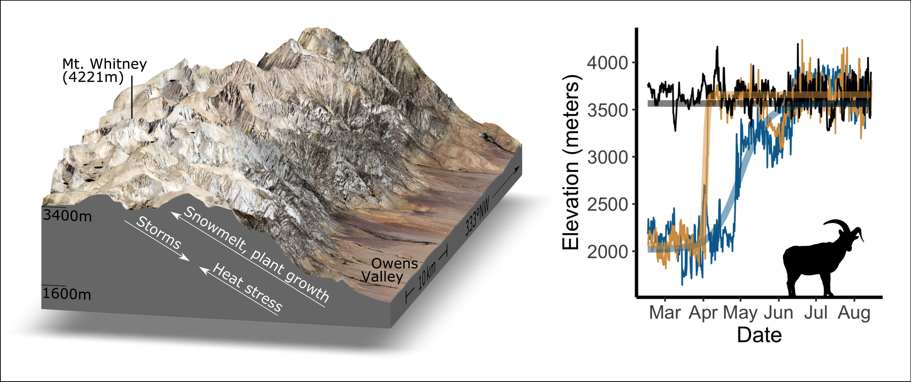

## Factors driving selection for elevation during migration

### Overview

This repository contains code to produce the results in John et al. 2024, *Scientific Reports* (in press). 

### Citation

John, C., Avgar, T., Rittger, K., Smith, J.A., Stephenson, L., Stephenson, T.R., and Post, E. (In press) Pursuit and escape drive fine-scale movement variation during migration in a temperate alpine ungulate. Scientific Reports.

### Notes

Because Sierra bighorn are endangered, GPS data cannot be made publicly available. Please see publication for more details on data sharing.

Script guide:
* Scripts starting with 000_ are functions and parameter settings.
* Scripts starting with 00*_ are for data wrangling.
* Scripts starting with 01*_ are analyses and visualizations.